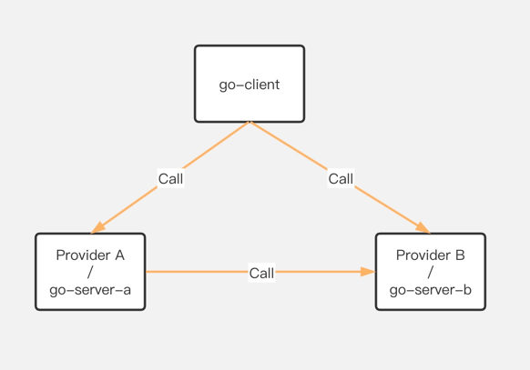

# Zipkin 在 Dubbo-go 应用示例

# 背景

Zipkin是一个分布式跟踪系统。它有助于收集解决 Dubbo-go 服务中的延迟问题所需的时序数据。
包括该数据的收集和查找。

# 介绍

本示例演示了 Zipkin 在 Dubbo-go 应用程序中的基本用法。

```markdown
.
├── README.md
├── README_zh.md
├── docker-compose.yml
├── go-client
├── go-server-a
├── go-server-b
└── prometheus
```

- go-client ：服务消费者
- go-server-a ：服务提供者 A
- go-server-b ：服务提供者 B

为了演示效果，示例中 Client 会同时对 ProviderA 与 ProviderB 发起请求，
ProviderA 内部也会对 ProviderB 发起请求！

依赖关系：



## 代码说明

服务启动时注册 Zipkin，包括 Reporter，Endpoint，Tracer，默认采样比例全采样 `AlwaysSample` ，可自行配置

```go
func registerZipkin() {
	// set up a span reporter
	reporter := zipkinhttp.NewReporter("http://localhost:9411/api/v2/spans")

	// create our local service endpoint
	endpoint, err := zipkin.NewEndpoint("go-server-a", "localhost:80")
	if err != nil {
		gxlog.CError("unable to create local endpoint: %+v\n", err)
	}

    // set sampler , default AlwaysSample
    // sampler := zipkin.NewModuloSampler(1)

	// initialize our tracer
	// nativeTracer, err := zipkin.NewTracer(reporter, zipkin.WithLocalEndpoint(endpoint), zipkin.WithSampler(sampler))
	nativeTracer, err := zipkin.NewTracer(reporter, zipkin.WithLocalEndpoint(endpoint))
	if err != nil {
		gxlog.CError("unable to create tracer: %+v\n", err)
	}

	// use zipkin-go-opentracing to wrap our tracer
	tracer := zipkinot.Wrap(nativeTracer)

	// optionally set as Global OpenTracing tracer instance
	opentracing.SetGlobalTracer(tracer)
}
```

## 配置

服务提供者配置过滤器：

```yaml

services:
  ...
filter: "tracing"

```

## 过滤器

Dubbo-go 提供 opentrace filter 实现，基于简单配置即可

```go
func (tf *tracingFilter) Invoke(ctx context.Context, invoker protocol.Invoker, invocation protocol.Invocation) protocol.Result {
	var (
		spanCtx context.Context
		span    opentracing.Span
	)
	operationName := invoker.GetUrl().ServiceKey() + "#" + invocation.MethodName()

	wiredCtx := ctx.Value(constant.TRACING_REMOTE_SPAN_CTX)
	preSpan := opentracing.SpanFromContext(ctx)

	if preSpan != nil {
		// it means that someone already create a span to trace, so we use the span to be the parent span
		span = opentracing.StartSpan(operationName, opentracing.ChildOf(preSpan.Context()))
		spanCtx = opentracing.ContextWithSpan(ctx, span)

	} else if wiredCtx != nil {

		// it means that there has a remote span, usually from client side. so we use this as the parent
		span = opentracing.StartSpan(operationName, opentracing.ChildOf(wiredCtx.(opentracing.SpanContext)))
		spanCtx = opentracing.ContextWithSpan(ctx, span)
	} else {
		// it means that there is not any span, so we create a span as the root span.
		span, spanCtx = opentracing.StartSpanFromContext(ctx, operationName)
	}

	defer func() {
		span.Finish()
	}()

	result := invoker.Invoke(spanCtx, invocation)
	span.SetTag(successKey, result.Error() == nil)
	if result.Error() != nil {
		span.LogFields(log.String(errorKey, result.Error().Error()))
	}
	return result
}
```


## 安装 Zipkin

第一种：

参考 [Zipkin's quick start](https://zipkin.io/pages/quickstart.html) 安装 Zopkin

Follow [Zipkin's quick start](https://zipkin.io/pages/quickstart.html) to install zipkin.

```bash
curl -sSL https://zipkin.io/quickstart.sh | bash -s
```

Zipkin支持多种后端存储，包括Cassandra, ElasticSearch和MySQL。这里我们使用最简单的内存存储作为演示目的。


```bash
java -jar zipkin.jar
```

您可以通过访问 http://localhost:9411 验证安装效果

或者使用 Docker :

See [/dubbo-go-sample/zipkin/docker/docker-compose.yml](docker-compose.yml)

```dockerfile
version: '2.4'

services:
  # The zipkin process services the UI, and also exposes a POST endpoint that
  # instrumentation can send trace data to.
  zipkin:
    image: ghcr.io/openzipkin/zipkin-slim:${TAG:-latest}
    container_name: zipkin
    # Environment settings are defined here https://github.com/openzipkin/zipkin/blob/master/zipkin-server/README.md#environment-variables
    environment:
      - STORAGE_TYPE=mem
      # Point the zipkin at the storage backend
      - MYSQL_HOST=mysql
      # Uncomment to enable self-tracing
      # - SELF_TRACING_ENABLED=true
      # Uncomment to increase heap size
      # - JAVA_OPTS=-Xms128m -Xmx128m -XX:+ExitOnOutOfMemoryError
    ports:
      # Port used for the Zipkin UI and HTTP Api
      - 9411:9411
    # Uncomment to enable debug logging
    # command: --logging.level.zipkin2=DEBUG
```

## 如何运行
请参阅根目录中的 [HOWTO.md](../HOWTO_zh.md) 来运行本例。

## 效果

链路：

